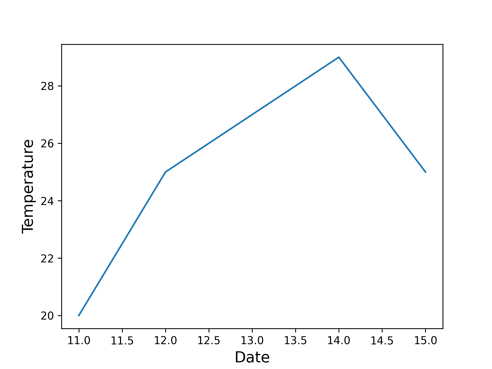

# 목차 
- Google Colab 환경 이해하기  
- Matplotlib 활용하기
- 데이터 시각화   

---

## Colab이란?
: 브라우저 내에서 Python 스크립트를 공유하고 실행하능한 문서. 

---
## Matplotlib
: 파이썬으로 만든 데이터 시각화 라이브러리입니다.  

---

### [화면녹화] Google Colab 문서만들기 
1. 웹 브라우져로 구글 웹사이트이동하기 
2. 구글 드라이브 접속하기 
3. 내 드라이브로 이동해서 신규 폴더 만들기 
4. 폴더 안에서 Google Colabolator 실행하기
---
### [화면녹화] Google Colaboator 기능 소개 

1. 웹 페이지 구성 
2. 셀의 개념과 실행하는 법 
3. 코드 셀 
4. 텍스트 셀 

---
#### 1.웹 페이지 구성

- 파일 제목 
- 런타임 : 원격 컴퓨터 연결 
- 코드 셀 
- 텍스트 셀  
- 파일 
---

### 2. 셀의 개념과 실행하는 법 

: 위 셀의 코드를 실행하려면 셀을 클릭하여 선택한 후 코드 왼쪽의 실행 버튼을 누르거나 단축키 'Command/Ctrl+Enter'를 사용하세요. 셀을 클릭하면 코드 수정을 바로 시작할 수 있습니다.

**특정 셀에서 정의한 변수를 나중에 다른 셀에서 사용할 수 있습니다.**

---

# Matplot 튜토리얼 

---


```python
import matplotlib.pyplot as plt
```

---

```python
import matplotlib.pyplot as plt

temp = [20, 25, 27, 29, 25]
```
---

```python
import matplotlib.pyplot as plt

temp = [20, 25, 27, 29, 25]

fig, ax = plt.subplots() 
```

---

```python
import matplotlib.pyplot as plt

temp = [20, 25, 27, 29, 25]

fig, ax = plt.subplots() 

ax.plot(temp)

plt.show() 
```


---

```python
import matplotlib.pyplot as plt

temp = [20, 25, 27, 29, 25]
date = [11, 12, 13, 14, 15]

fig, ax = plt.subplots()
ax.plot(date, temp)

plt.show()
```


---

```python
import matplotlib.pyplot as plt

temp = [20, 25, 27, 29, 25]
date = [11, 12, 13, 14, 15]

fig, ax = plt.subplots()
ax.plot(date, temp)
ax.set_xlabel("Date", fontsize=14)
ax.set_ylabel("Temperature", fontsize=14)


plt.show()
```



---

```python
import matplotlib.pyplot as plt

temp = [20, 25, 27, 29, 25]
date = [11, 12, 13, 14, 15]

fig, ax = plt.subplots()
ax.plot(date, temp)
ax.set_xlabel("Date", fontsize=14)
ax.set_ylabel("Temperature", fontsize=14)
plt.xticks([int(d) for d in date])

plt.show()
```


---

```python
import matplotlib.pyplot as plt

temp = [20, 25, 27, 29, 25]
date = [11, 12, 13, 14, 15]

plt.style.use('bmh')
fig, ax = plt.subplots()
ax.plot(date, temp)
ax.set_xlabel("Date", fontsize=14)
ax.set_ylabel("Temperature", fontsize=14)
plt.xticks([int(d) for d in date])

plt.show()
```


---

```python
import matplotlib.pyplot as plt

fig, ax = plt.subplots()

ax.scatter(2, 4) 

plt.show()
```


---

```python 
import matplotlib.pyplot as plt

temp = [20, 25, 27, 29, 25]
date = [11, 12, 13, 14, 15]

fig, ax = plt.subplots()
ax.scatter(date, temp)

ax.set_xlabel("Date", fontsize=14)
ax.set_ylabel("Temperature", fontsize=14)

plt.show()

```


---

```python 
import matplotlib.pyplot as plt

temp = [20, 25, 27, 29, 25]
date = [11, 12, 13, 14, 15]

fig, ax = plt.subplots()
ax.scatter(date, temp)

ax.set_xlabel("Date", fontsize=14)
ax.set_ylabel("Temperature", fontsize=14)

ax.axis([1, 30, 13, 40])
plt.show()

```


--- 

```python 
import matplotlib.pyplot as plt

temp = [20, 25, 27, 29, 25]
date = [11, 12, 13, 14, 15]

plt.style.use('seaborn-v0_8-dark-palette')
fig, ax = plt.subplots()
ax.scatter(date, temp, s=100)

ax.set_title("Temperature of the Date", fontsize=24)
ax.set_xlabel("Date", fontsize=14)
ax.set_ylabel("Temperature", fontsize=14)

ax.tick_params(labelsize=14)

plt.show()

```


---

```python
import matplotlib.pyplot as plt
from google.colab import files

temp = [20, 25, 27, 29, 25]
date = [11, 12, 13, 14, 15]

plt.style.use('seaborn-v0_8-dark-palette')
fig, ax = plt.subplots()
ax.scatter(date, temp, s=100)

ax.set_xlabel("Date", fontsize=14)
ax.set_ylabel("Temperature", fontsize=14)
ax.axis([1, 30, 13, 40])

ax.tick_params(labelsize=14)

plt.savefig('chart.png', format='png', dpi=300)
#plt.show()
files.download('chart.png')
plt.close()
```

---

# 정리
- 데이터로 그래프 만들기
- 그래프를 보기 좋게 만들기
- 데이터를 점으로 표현해보기
- 축의 범위를 지정하기
- 그래프를 저장하기
---
<body>
<h1 style="text-align: center; color: white;">감사합니다.<h1>
<h2 style="text-align: center; color: cyan">공학도서관</h2>
<h2 style="text-align: center;" >www.gongdo.kr<h2>
</body>


