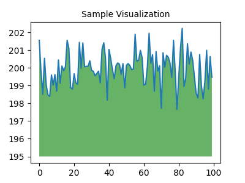
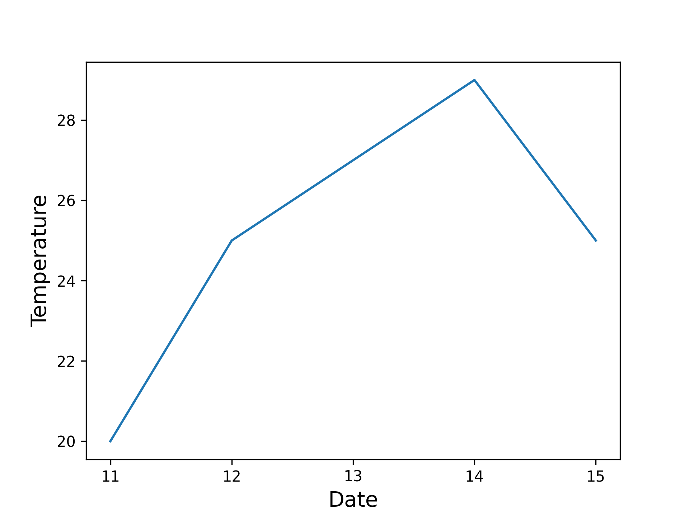

---

marp: true
theme: my-theme
paginate: true
#header: 포르쉐 빌리브인드림 BEE Quiz 
#footer: 공학도서관 
style: |
  .columns {
    display: grid;
    grid-template-columns: repeat(2, minmax(0, 1fr));
    gap: 1rem;
  }
  .code {
    font-family:"Cascadia Code"
  }


---

<!--paginate: skip -->
<body>
<h1 style="text-align: center; color: cyan;">공학도서관<h1>
<h2 style="text-align: center; color: white">www.gongdo.kr<h2>
</body>

--- 

###### 포르쉐 빌리드인드림 Bee Quiz  

# 구글 Colab으로
# Matplotlib 실습하기   


---

<!--paginate: true -->
# 목차 
- Matplotlib 소개 
- 실습공간 만들기 
- Matplotlib 튜토리얼  
---

## Matplotlib
: 파이썬으로 만든 데이터 시각화 라이브러리 중에 하나입니다. 

---

### [화면녹화] 실습공간 만들기 
1. 웹 브라우져로 구글 웹사이트이동하기 
2. 구글 드라이브 접속하기 
3. 내 드라이브로 이동해서 신규 폴더 만들기 
4. 폴더 안에서 Google Colabolator 실행하기
---
### [화면녹화] Google Colaboator 소개 

1. 웹 페이지 구성 
2. 셀의 개념과 실행하는 법 
3. 코드 셀 
4. 텍스트 셀 

---
## Colab이란?
: Colaboratory(줄여서 'Colab'이라고 함)을 통해 브라우저 내에서 Python 스크립트를 작성하고 실행할 수 있습니다.

- 구성이 필요하지 않음
- 무료로 GPU 사용
- 간편한 공유

---
#### 1.웹 페이지 구성

- 파일 제목 
- 런타임 : 원격 컴퓨터 연결 
- 코드 셀 
- 텍스트 셀  
- 파일 
---

### 2. 셀의 개념과 실행하는 법 

: 위 셀의 코드를 실행하려면 셀을 클릭하여 선택한 후 코드 왼쪽의 실행 버튼을 누르거나 단축키 'Command/Ctrl+Enter'를 사용하세요. 셀을 클릭하면 코드 수정을 바로 시작할 수 있습니다.

**특정 셀에서 정의한 변수를 나중에 다른 셀에서 사용할 수 있습니다.**

---

### 3.데이터 과학 
: Colab을 통해 인기 있는 Python 라이브러리를 최대한 활용하여 데이터를 분석하고 시각화할 수 있습니다. 아래 코드 셀에서는 Numpy를 사용하여 임의의 데이터를 생성하고 매트플롯립으로 이를 시각화합니다. 셀을 클릭하면 코드 수정을 바로 시작할 수 있습니다.

---

```python
import numpy as np
import IPython.display as display
from matplotlib import pyplot as plt
import io
import base64

ys = 200 + np.random.randn(100)
x = [x for x in range(len(ys))]

fig = plt.figure(figsize=(4, 3), facecolor='w')
plt.plot(x, ys, '-')
plt.fill_between(x, ys, 195, where=(ys > 195), facecolor='g', alpha=0.6)
plt.title("Sample Visualization", fontsize=10)

data = io.BytesIO()
plt.savefig(data)
image = F"data:image/png;base64,{base64.b64encode(data.getvalue()).decode()}"
alt = "Sample Visualization"
display.display(display.Markdown(F""""""))
plt.close(fig)
```


---

# Matplot 튜토리얼 

---
<section>
<header>그래프 그리기 </header> 
</section>

```python
import matplotlib.pyplot as plt

temp = [20, 25, 27, 29, 25]

fig, ax = plt.subplots() 

ax.plot(temp)

plt.show() 
```
<!--
fix는 그래프 컬렉션, ax는 그림에 포함될 그래프를 의미합니다.
Matplot 뷰어를 열고 그래프를 표시합니다.
-->


---

```python
import matplotlib.pyplot as plt

temp = [20, 25, 27, 29, 25]
date = [11, 12, 13, 14, 15]

fig, ax = plt.subplots()
ax.plot(date, temp)

plt.show()
```


---
### Label 넣기 
```python
import matplotlib.pyplot as plt

temp = [20, 25, 27, 29, 25]
date = [11, 12, 13, 14, 15]

fig, ax = plt.subplots()
ax.plot(date, temp)
ax.set_xlabel("Date", fontsize=14)
ax.set_ylabel("Temperature", fontsize=14)


plt.show()
```


---
### 눈금표시하기 

```python
import matplotlib.pyplot as plt

temp = [20, 25, 27, 29, 25]
date = [11, 12, 13, 14, 15]

fig, ax = plt.subplots()
ax.plot(date, temp)
ax.set_xlabel("Date", fontsize=14)
ax.set_ylabel("Temperature", fontsize=14)
plt.xticks([int(d) for d in date])

plt.show()
```



---
### 그래프 스타일 적용하기
```python
import matplotlib.pyplot as plt

temp = [20, 25, 27, 29, 25]
date = [11, 12, 13, 14, 15]

plt.style.use('bmh')
fig, ax = plt.subplots()
ax.plot(date, temp)
ax.set_xlabel("Date", fontsize=14)
ax.set_ylabel("Temperature", fontsize=14)
plt.xticks([int(d) for d in date])

plt.show()
```


<!-- 런타임을 종료해야 다음 셀에 적용할 떄 스타일이 적용되는 이슈가 있습니다. -->

---
### 실습지  
: 코드 셀에 plt.style에에available을 입력하여 내장되어있는 다양한 그래프 스타일을 확인하고 전에 작성했던 코드를 수정해서 시도해보자. 

---

### 점으로 표현하기 
```python
import matplotlib.pyplot as plt

fig, ax = plt.subplots()

ax.scatter(2, 4) 

plt.show()
```


---
### x축 좌표
```python 
import matplotlib.pyplot as plt

temp = [20, 25, 27, 29, 25]
date = [11, 12, 13, 14, 15]

fig, ax = plt.subplots()
ax.scatter(date, temp)

ax.set_xlabel("Date", fontsize=14)
ax.set_ylabel("Temperature", fontsize=14)

plt.show()

```


---

### 범위정하기 
```python 
import matplotlib.pyplot as plt

temp = [20, 25, 27, 29, 25]
date = [11, 12, 13, 14, 15]

fig, ax = plt.subplots()
ax.scatter(date, temp)

ax.set_xlabel("Date", fontsize=14)
ax.set_ylabel("Temperature", fontsize=14)

ax.axis([1, 30, 13, 40])
plt.show()

```


--- 
### 스타일 적용하기 
```python 
import matplotlib.pyplot as plt

temp = [20, 25, 27, 29, 25]
date = [11, 12, 13, 14, 15]

plt.style.use('seaborn-v0_8-dark-palette')
fig, ax = plt.subplots()
ax.scatter(date, temp, s=100)

ax.set_title("Temperature of the Date", fontsize=24)
ax.set_xlabel("Date", fontsize=14)
ax.set_ylabel("Temperature", fontsize=14)

ax.tick_params(labelsize=14)

plt.show()

```


---
### 그래프 저장하기 

```python
import matplotlib.pyplot as plt
from google.colab import files

temp = [20, 25, 27, 29, 25]
date = [11, 12, 13, 14, 15]

plt.style.use('seaborn-v0_8-dark-palette')
fig, ax = plt.subplots()
ax.scatter(date, temp, s=100)

ax.set_xlabel("Date", fontsize=14)
ax.set_ylabel("Temperature", fontsize=14)
ax.axis([1, 30, 13, 40])

ax.tick_params(labelsize=14)

plt.savefig('chart.png', format='png', dpi=300)
#plt.show()
files.download('chart.png')
plt.close()
```

---

# 정리
- 데이터로 그래프 만들기
- 그래프를 보기 좋게 만들기
- 데이터를 점으로 표현해보기
- 축의 범위를 지정하기
- 그래프를 저장하기
---
<body>
<h1 style="text-align: center; color: white;">감사합니다.<h1>
<h2 style="text-align: center; color: cyan">공학도서관</h2>
<h2 style="text-align: center;" >www.gongdo.kr<h2>
</body>
