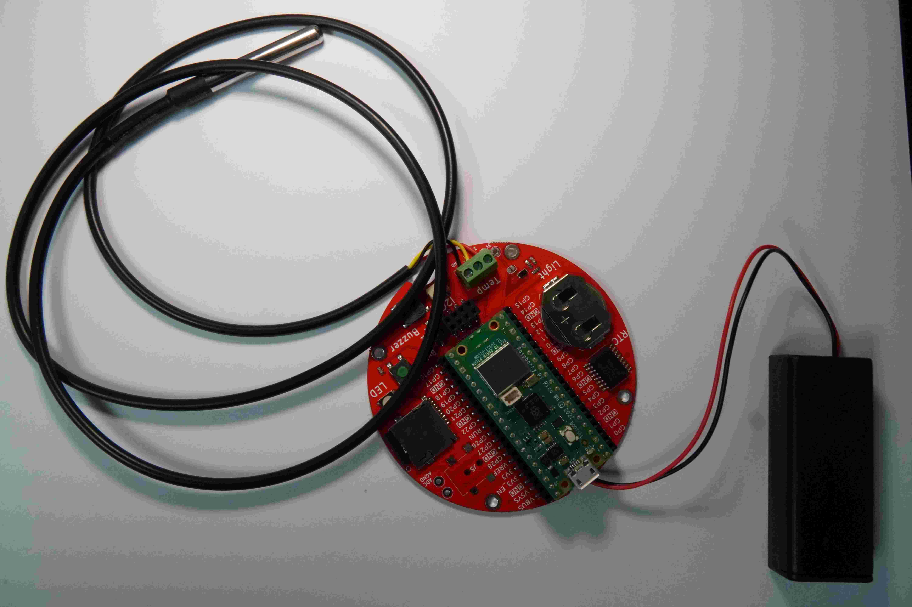
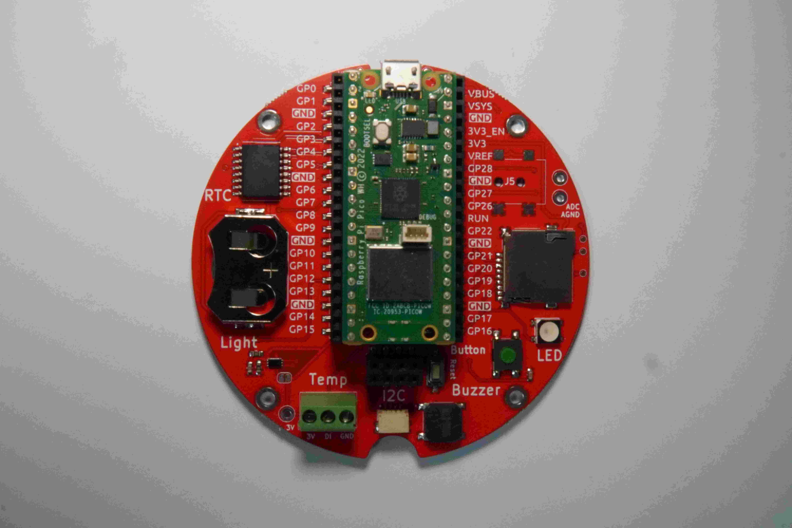
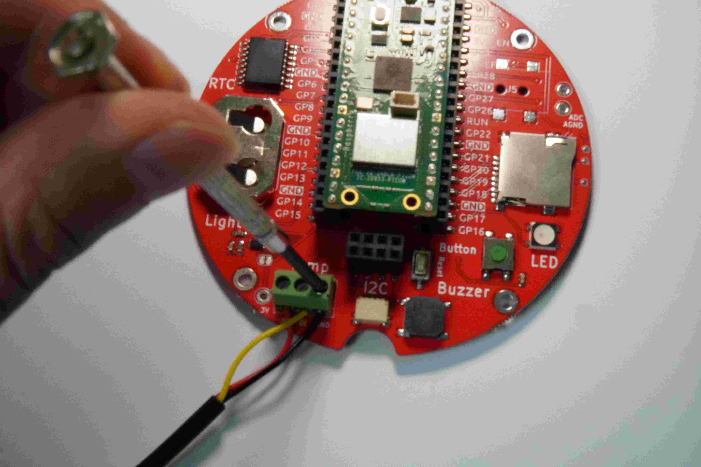
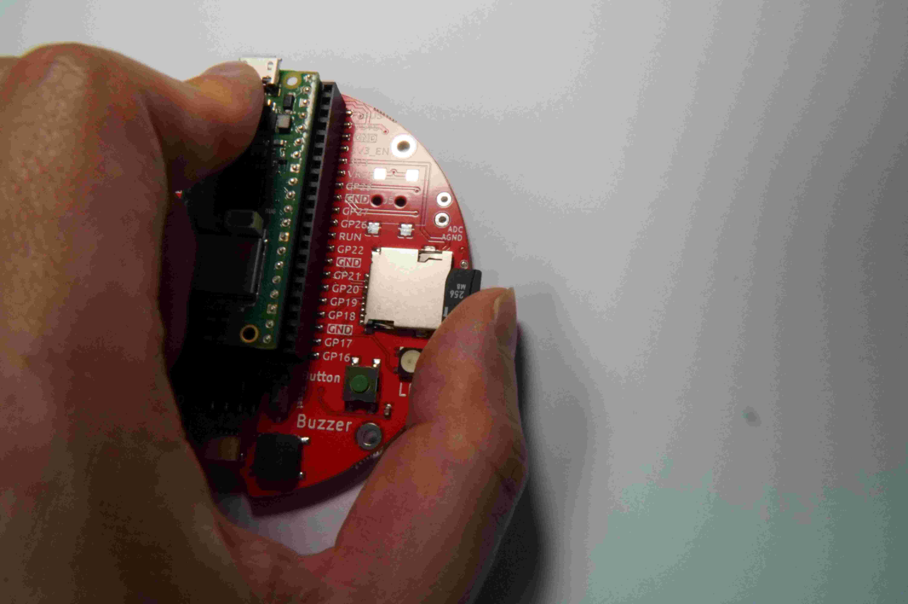
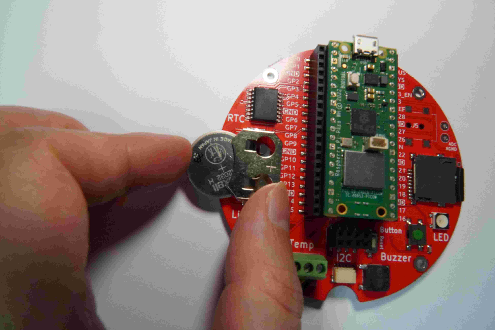
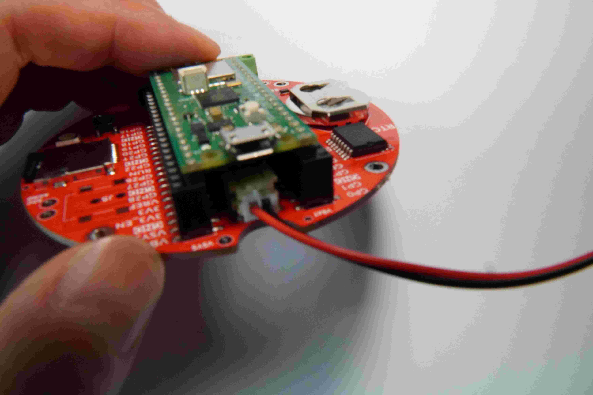
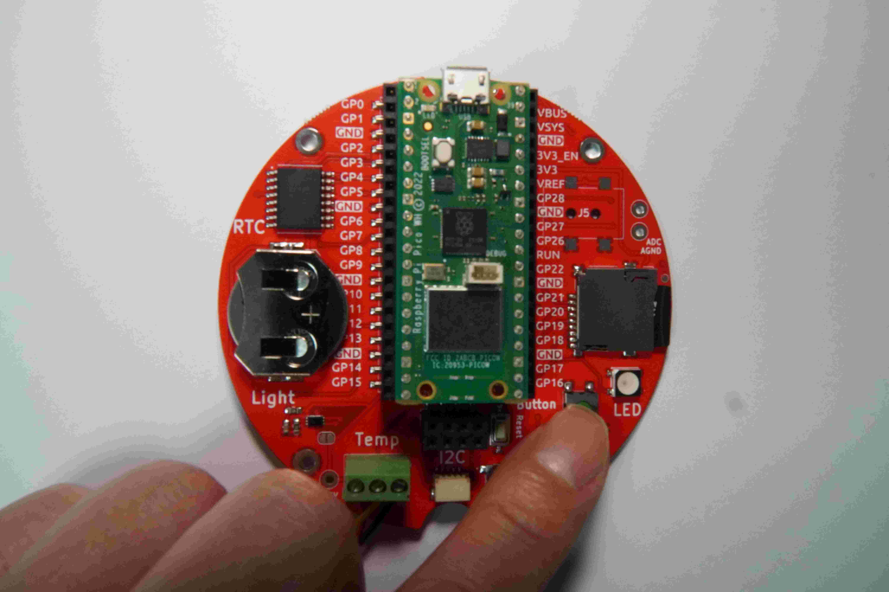
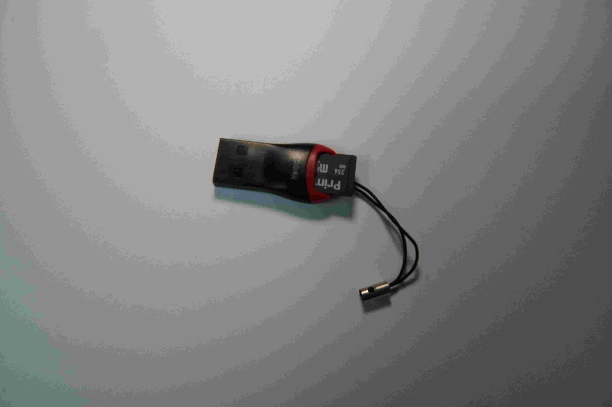
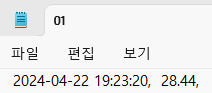

---

marp: true
theme: my-theme
paginate: true
header: 포르쉐 빌리브인드림 BEE Quiz 
footer: 공학도서관 

---

<!--paginate: skip -->
<body>
<h1 style="text-align: center; color: cyan;">공학도서관<h1>
<h2 style="text-align: center; color: white">www.gongdo.kr<h2>
</body>

--- 

###### 포르쉐 빌리드인드림 Bee Quiz  

# DataPi 키트 및 
# 어반비즈 교구 소개하기  

---

# 목차 
- 데이터 파이 키트 구성품 확인
- 데이터 파이에 대한 소개 
- 데이터 파이 사용시 주의사항 
---
# 구성품 

<!--paginate: true -->
---

- 데이타파이 
- 마이크로 USB 케이블 
- 마이크로 sdcard
- 코인베터리 
- AA 베터리 케이스 
- AA 베터리 10개 
- 온도센서 (연결되어있음)

---

# 주요기능 

---

- 버튼 입력
- LED로 상태확인  
    - 네오픽셀 
    - 소형 LED 
- 온도 측정 
- SD 카드에 데이터 저장

---
### 데이타 파이 관찰하기

---

### 온도센서 연결하기 

---
### 마이크로 SD카드 넣기 

---

### 코인베터리 넣기  

--- 

### 베터리 케이스에 AA 베터리 3개 넣기  
(베터리 케이스 참고사진)

---

### 베터리 단자에 커넥터 연결하기

---

### 베터리가 잘 연결되었을 경우
-> 녹색 LED 점등 (LED 불들어온 경우 참고사진) 

--- 

# 동작 테스트 해보기

---
### 온도 센서 기록하기

---

### 마이크로 SD카드 추출하기

---

### 마이크로 SD카드를 리더기에 넣기 

--- 

### sd카드 폴더 열기
1. 윈도우 탐색기
2. 파일 선택 후 '메모장'으로 열기 
3. 메모장으로 열었을 때 데이터가 한줄 기록되어있는지 확인   

--- 

# 문제점 해결하기 

---
1. 데이터 기록이 안됬습니다. 
-> sd카드가 제대로 꼽혀 있는지 확인해주세요. 

2. 상태 버튼에 불이 안들어옵니다.
-> 베터리 커넥터가 잘 들어갔는지 확인합니다. 
-> 베터리 케이스의 스위치가 On으로 되어있는지 확인합니다.   

---
<body>
<h1 style="text-align: center; color: white;">감사합니다.<h1>
<h2 style="text-align: center; color: cyan">공학도서관</h2>
<h2 style="text-align: center;" >www.gongdo.kr<h2>
</body>
